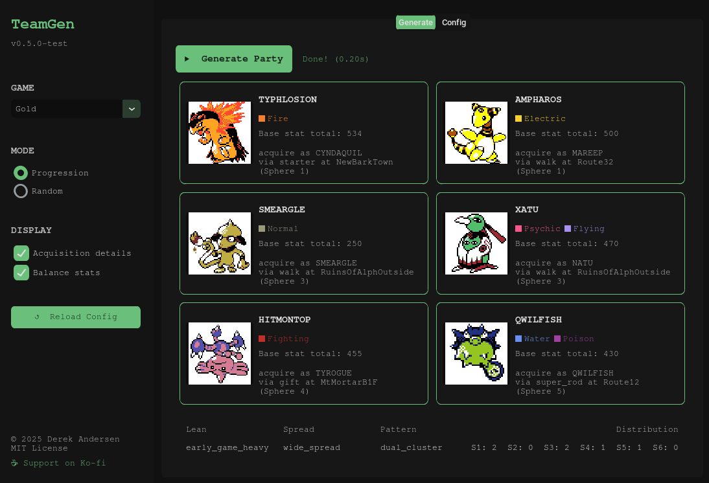

# _TeamGen_ – Universal Party Generator

A tool for generating a random, progression-viable party of Pokémon for use in a playthrough. 
Pokémon availability and game progression are respected in the final output, and customization options are 
available to curate the output further.

  

## Table of contents
1. [Introduction](#introduction)
2. [Currently supported games](#currently-supported-games)
3. [Installation](#installation)
4. [Usage](#usage)
5. [Contributing](#contributing)
6. [License](#license)

## Introduction
_TeamGen_ generates (prescribes) a party for use in a playthrough — either to introduce an element of 
challenge or simply for team inspiration. 
The app is **universal** in the sense that it maintains compatibility with _most_ generations of Pokémon, 
and also with romhacks that might contain the following (as long as the relevant game data files are added):
- New Pokémon
- New locations 
- Changes to existing game data (location data, evolution methods, etc.)

## Currently supported games
- **Vanilla**
  - Pokémon Red & Blue
  - Pokémon Gold & Silver
  - Pokémon Ruby & Sapphire
- **Romhacks**
  - [Pokémon Solus RGB](https://github.com/Dechrissen/poke-solus-rgb)

## Installation

### Pre-built executable (Windows/Linux)

1. Download `teamgen-<version>-<platform>.zip` from the [latest release](https://github.com/Dechrissen/teamgen/releases/latest) 
2. Extract
3. Run `teamgen.exe` on Windows, or `teamgen` on Linux

### Command-line app

Prerequisites:
- Python 3.10+
- `pip`
- `venv`

Steps:
1. Clone this repository (or download the [latest release](https://github.com/Dechrissen/teamgen/releases/latest) 
   source code and extract it)
2. `cd teamgen`
3. (First-time setup) Create a virtual environment (`python -m venv .venv`)
4. Activate the virtual environment  (`source .venv/bin/activate`)
5. Install dependencies (`pip install -r requirements.txt`)
6. (Optional) If you want sprites to display in the GUI, run `python main.py --fetch_sprites`
7. Run (`python main.py`, or for the CLI UI, `python main.py --ui=cli`)

## Usage

### Using the app
- `ENTER` – Generate a party with the current settings
- `M` – Toggle the generation mode between 'Progression' and 'Random'
  - Progression: Considers game data, locations, progression, config settings
  - Random: Completely random generation using current game's National Dex
- `G` – Open the 'Supported Games' menu to switch current game
- `R` – Reload the config file (after making any config changes while the app is running)
- `H` – Display help menu
- `Q` – Quit the app

### Changing config settings
Open `/config/config_gen1.yaml` (for example, for Generation 1 games). Modify values according to your preferences. 
Save the file and then use the `R` option in the app to reload.

> [!NOTE]
> If you are running the Windows executable, the config files are in `/_internal/config`.

## Contributing

If you'd like to add support for a missing game or romhack, see [`CONTRIBUTING.md`](/CONTRIBUTING.md).

## License
_TeamGen_ is licensed under the MIT License. See [`LICENSE`](/LICENSE) for full details.
